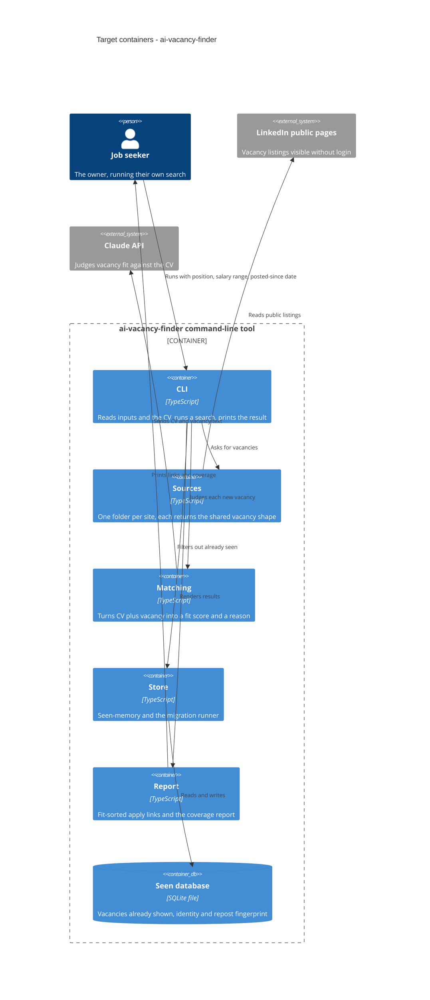

# Architecture map — ai-vacancy-finder

> The **target foundation** (greenfield-bootstrap): nothing is built yet, so every path below is
> planned and materialized by `scaffold` from `docs/features/_scaffold/tasks.json`. Once the
> skeleton exists, refresh with `survey`. Intent source: `docs/idea-brief.md`.

## Stack

- Language / runtime: TypeScript on Node 22, ES modules (`docs/adr/0001-use-typescript-on-node-22.md`)
- Frameworks / libraries (planned): no web framework (command-line tool); the built-in fetch for HTTP; cheerio for reading vacancy HTML; the official Anthropic SDK for fit judgments; zod for the vacancy shape and for validating AI output; better-sqlite3 for storage; Node's built-in argument parser for the command line
- Build / test / lint: `npm run build` (tsc) · `npm test` (vitest) · `npm run lint` (eslint) — the machine keys above feed `implement`
- Secrets: the AI key comes from the `ANTHROPIC_API_KEY` environment variable, never from a committed file
- Shape: a command-line program run on demand; a schedule later means scheduling the same command (`docs/idea-brief.md` §7)

## C4 — target baseline

## Module inventory

| Module | Path (planned) | Layers | Wired at | Responsibility |
|---|---|---|---|---|
| cli | `src/cli.ts` | entry | `src/cli.ts` (bin entry in `package.json`) | Parse inputs, load the CV, run the search pipeline, exit code |
| domain | `src/domain/` | shared types | imported everywhere | Vacancy shape, search input, fit result (zod schemas) |
| sources | `src/sources/<site>/` | adapter behind a source interface | registry in `src/sources/index.ts` | One folder per site; `linkedin/` first; returns the shared vacancy shape or a typed error |
| matching | `src/matching/` | adapter behind a fit-judge interface | wired in `src/cli.ts` | CV plus vacancy in, fit score plus one-line reason out; the AI client lives here |
| store | `src/store/` | adapter behind a seen-store interface | wired in `src/cli.ts` | Seen-memory, repost fingerprint, migration runner |
| report | `src/report/` | pure rendering | called from `src/cli.ts` | Fit-sorted apply links, "salary not listed" tags, coverage report |
| migrations | `migrations/` | SQL files | applied by `src/store/` runner | Numbered `NNNN_name.up.sql` / `.down.sql` pairs |
| tests | `test/`, `test/fixtures/` | tests | run by `npm test` | Saved vacancy pages, fake fit judge, migration round-trip |

## Conventions (the rules every feature must match; cited to the decisions that fix them)

- **Module wiring / registration:** three small interfaces (vacancy source, fit judge, seen-store) are the only seams; concrete adapters are wired once in `src/cli.ts` — `docs/adr/0002-organize-code-as-one-folder-per-vacancy-source.md`
- **Error handling:** a source that fails or returns nothing raises a typed error that the coverage report shows; errors are never swallowed and an empty list is never printed without its coverage line — `docs/idea-brief.md` §6, §7 and `docs/adr/0002-organize-code-as-one-folder-per-vacancy-source.md`
- **IDs:** vacancy identity is the source name plus the site's own job number; a company-plus-title fingerprint sits beside it to catch reposts — `docs/adr/0003-keep-seen-memory-in-a-local-sqlite-file.md`
- **Persistence / DB access:** only `src/store/` touches the database file, through the seen-store interface — `docs/adr/0003-keep-seen-memory-in-a-local-sqlite-file.md`
- **Migrations:** `migrations/NNNN_name.up.sql` with a matching `.down.sql`, applied in order by the in-repo runner, version kept in SQLite `user_version` (the convention `data-model` detects and follows) — `docs/adr/0003-keep-seen-memory-in-a-local-sqlite-file.md`
- **Tests:** vitest; sources are tested against saved real pages in `test/fixtures/`, never the live site; the AI judge is tested against a fake; one smoke test proves the CLI boots — `docs/adr/0002-organize-code-as-one-folder-per-vacancy-source.md`
- **Salary handling:** vacancies with no stated salary are kept, tagged "salary not listed" and shown below confirmed ones; a stated salary outside the range is dropped — `docs/idea-brief.md` §6
- **UI / styling:** none — a command-line tool (`frontend: ""`)

## Datastores

| Store | Engine | Accessed via | Notes |
|---|---|---|---|
| Seen database | SQLite, one local file (gitignored) | better-sqlite3, only from `src/store/` | Deleting the file resets the "already seen" memory |

## Frontend / UI foundation

<!-- N/A: no frontend -->

## Where things live / closest precedents

- A new vacancy source (another site, a company career page) → `src/sources/<site>/`, modelled on `src/sources/linkedin/` once it exists; register it in `src/sources/index.ts`.
- A new filter input → the search-input schema in `src/domain/`, applied in `src/cli.ts` before matching.
- A new stored field → a new numbered migration pair in `migrations/`, read and written only through `src/store/`.
- A change to how fit is judged → `src/matching/`, behind the fit-judge interface, with the fake judge updated in tests.

## Constraints & known tech-debt

- Reading LinkedIn's public pages is against its terms and is likely to break or be blocked; the owner chose this knowingly (`docs/idea-brief.md` §6). Source code must fail loudly, never quietly.
- Public pages often show no salary, so the salary filter is weaker than it looks (`docs/idea-brief.md` §6).
- better-sqlite3 is a native library; an install on a machine with no matching prebuilt binary needs a build toolchain (`docs/adr/0003-keep-seen-memory-in-a-local-sqlite-file.md`).
- Each fit judgment calls a paid AI service, so how many vacancies are judged per run is an open cost question (`docs/idea-brief.md` §8).
- CV format (plain text, Markdown, PDF) is not decided (`docs/idea-brief.md` §8); the first skeleton assumes a text or Markdown file.

## Reconciliation with the authored architecture doc

No authored architecture doc exists (no `docs/architecture.md`, `ARCHITECTURE.md` or root `CLAUDE.md`); this map is the reference. The intent it follows is `docs/idea-brief.md`, and the three foundational decisions are `docs/adr/0001-*`, `0002-*`, `0003-*`.
