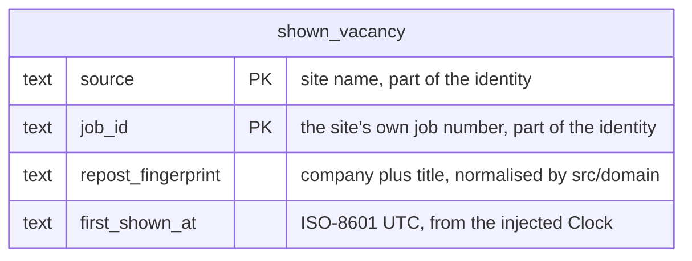

# Data model — ai-vacancy-finder

The whole persistent state of this feature is the **seen memory**: one SQLite table, one row per vacancy that was actually shown to the job seeker. Everything else a run produces (dispositions, judgments, the coverage report) lives in memory for the length of the run and is never stored (`adr/0003-record-one-disposition-per-read-vacancy-and-derive-the-report.md`). The seen memory never holds CV text (spec §6.1).

## ER diagram

One entity, no relationships: nothing else in this feature references a vacancy, and application tracking is a non-goal (spec §3).

## Entities

### `shown_vacancy`

| Column | Type | Constraints | Notes |
|---|---|---|---|
| `source` | TEXT | NOT NULL, CHECK (length > 0), part of PK | Source name as registered in `src/sources/index.ts` (for example `linkedin`). |
| `job_id` | TEXT | NOT NULL, CHECK (length > 0), part of PK | The site's own job number, kept as text because a site may use a non-numeric id. |
| `repost_fingerprint` | TEXT | NOT NULL, CHECK (length > 0) | Company plus title, each lowercased with repeated spaces collapsed and nothing else normalised (AC-19). Built only by a function in `src/domain/`; the database stores it as an opaque string. |
| `first_shown_at` | TEXT | NOT NULL | ISO-8601 UTC timestamp of the first time the vacancy was shown. Taken from the injected `Clock` (ADR 0006), never from a database default, so tests with a fake clock are deterministic. Not read by any query today. |

**Aggregate root:** root (the only aggregate). The table is `STRICT` (column types are enforced) and `WITHOUT ROWID` (rows live directly in the primary-key index, so the identity lookup needs no second index).
**Primary key:** `(source, job_id)`, the vacancy identity of repo ADR 0003 and `CLAUDE.md` (Identity).
**Access patterns:**
- "Was this card already shown?" (sad §6 flows 1, 7, 8) → the primary key.
- "Is this card a repost of something shown?" (flows 7, 8) → `idx_shown_vacancy_repost_fingerprint`.
- "Mark these vacancies as shown" (flows 1, 2, 4–10, one transaction after rendering) → `INSERT ... ON CONFLICT (source, job_id) DO NOTHING`. The write must be idempotent because "show everything" re-marks vacancies that are already stored (flow 8); a repeated write changes nothing, including `first_shown_at`.

**Constraints:** PK `(source, job_id)`; NOT NULL on every column; CHECK not-empty on `source`, `job_id` and `repost_fingerprint`, so that an empty fingerprint can never make every vacancy look like a repost of every other. No foreign keys.
**Rules the schema deliberately does not enforce:**
- `repost_fingerprint` is **not unique**. Two vacancies shown in the same search may share a fingerprint and both are listed (AC-19), and a repost shown under "show everything" gets its own row under its new job number.
- Two vacancies read in the same search are never reposts of each other. That is pipeline logic in `src/search/`: the fingerprint lookup runs against the memory as it was before the search, and marking happens only after rendering.
- A vacancy that was dropped, not judged or lost to a failure has **no row** (AC-18, AC-22). Only shown vacancies are written.
- The fingerprint spans sources, since it is looked up without the `source` column. With one source this makes no difference; with a second source the same company and title on two sites would count as a repost, which is the intended dedupe. If that turns out wrong, a new migration can change the index.

**Deletion:** hard delete only, and only by deleting the whole file, which resets the memory (`docs/architecture-map.md`, Datastores). There is no per-row delete and no status column.

## Indexes

| Index | Columns | Query it serves |
|---|---|---|
| primary key (implicit, the table's own storage) | `(source, job_id)` | Identity lookup of a batch of cards, and the conflict target of the idempotent write (flows 1, 7, 8). |
| `idx_shown_vacancy_repost_fingerprint` | `repost_fingerprint` | Repost lookup of a batch of cards by fingerprint (flows 7, 8; AC-19, AC-20). |

No other index: no query reads `first_shown_at`, and there are no foreign keys to index. Both read paths were checked with `EXPLAIN QUERY PLAN` on SQLite 3.53.2 (the version bundled with `better-sqlite3` 12.x): the identity lookup is `SEARCH ... USING PRIMARY KEY`, the fingerprint lookup is `SEARCH ... USING COVERING INDEX idx_shown_vacancy_repost_fingerprint`.

## Migrations

Staged under `docs/features/ai-vacancy-finder/migrations/`, not in the live `migrations/` tree; `implement` promotes them.

| Staged file | Promoted as (hint) | What it does |
|---|---|---|
| `01_create_shown_vacancy.up.sql` | `migrations/0002_create_shown_vacancy.up.sql` | Creates `shown_vacancy` and its fingerprint index, both `IF NOT EXISTS`. |
| `01_create_shown_vacancy.down.sql` | `migrations/0002_create_shown_vacancy.down.sql` | Drops the index, then the table, both `IF EXISTS`. |

There is no expand-backfill-contract sequence: the table is new, so no existing table changes. The runner wraps each file in a transaction and sets `user_version` itself, so the files contain no transaction or pragma statements.

## Test fixtures

Not in `migrations/`. In the form the repo uses for tests (plain TypeScript helpers under `test/`, real SQLite in memory or a temporary file, as `test/migrate.test.ts` does):

- `aShownVacancy(overrides?)` — builds a row `{ source: "linkedin", job_id: "1000001", repost_fingerprint: "example co<sep>senior engineer", first_shown_at: "2026-01-01T00:00:00.000Z" }`, where `<sep>` is whatever separator `src/domain/` uses. Company names are fictional; no CV text or personal data appears anywhere in the fixtures.
- `openMemoryStore()` — opens an in-memory database, runs `migrate(db)` from `src/store/migrate.ts`, and returns it, so the seen-store and the two-run "0 vacancies listed twice" test (QG-3) run against the real schema.
