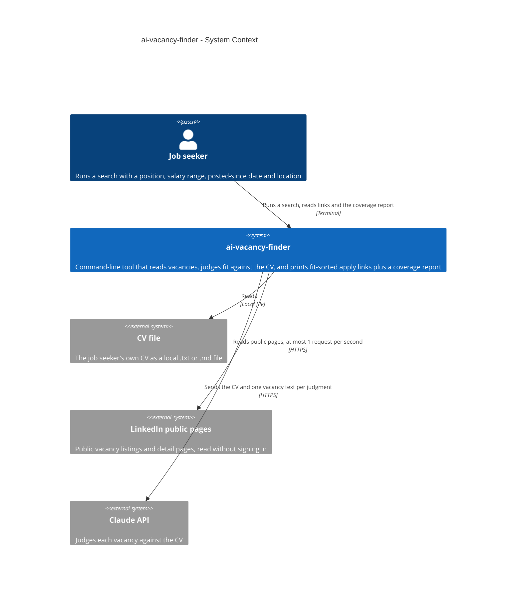
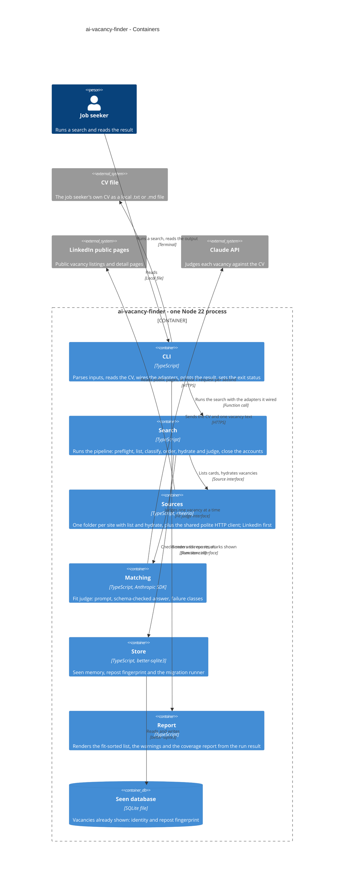
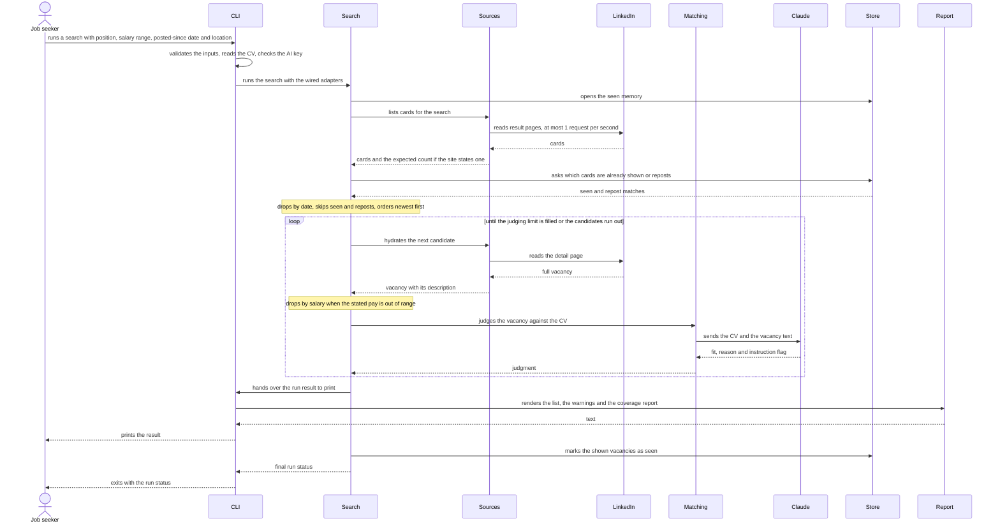
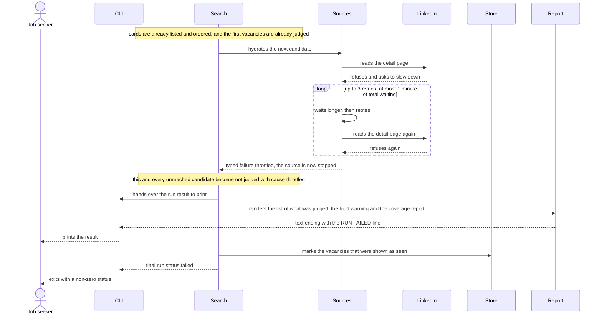

# Software Architecture Document — ai-vacancy-finder

## 1. Introduction and goals

**Intent.** A personal command-line tool for one job seeker. For a position, a salary range, a posted-since date and a location, it reads a source's public vacancy pages (LinkedIn first, no sign-in), judges each new vacancy against the job seeker's own CV with Claude, and prints apply links ordered by fit with a one-line reason. Every run ends with a coverage report that says what was read, dropped, judged and left unjudged, so a quiet or partial read never looks like "no jobs for you".

**Top-3 quality goals (1-liners; full scenarios in §10):**

1. **Auditable runs** — every run ends with a coverage report and never prints a bare empty list; a blocked, throttled, partial or empty read is loud (100% of runs end with a coverage report).
2. **Bounded cost and polite pace** — at most the judging limit (default 30) judgments per search, at most 1 page request per second toward each source, at most 5 min p95 per search.
3. **Seen-memory correctness** — each vacancy is shown once and a repost is recognised as already seen (0 vacancies listed twice across consecutive same-detail searches).

**Stakeholders.**

| Role | Interest | Sign-off owner? |
|---|---|---|
| Job seeker | Runs searches, reads the fit-sorted links and the coverage report, owns and approves this SAD | Yes |

## 2. Constraints

**Technical.**
- TypeScript on Node 22, ES modules; `engines` is `>=22` and the development machine runs 22.9.0 (repo ADR `docs/adr/0001-use-typescript-on-node-22.md`).
- `better-sqlite3` pinned to `^12.10.1`: the 13.0.3 prebuilt binary segfaults when opening a database on Node 22.9.0 (`CLAUDE.md` Gotchas). Re-test before moving to 13.
- Libraries the map plans but `package.json` does not list yet: `cheerio` (reading vacancy HTML), `zod` (the vacancy shape and validation of the AI's answer) and `@anthropic-ai/sdk` (used only in `src/matching/`). Everything else is built in: `fetch` for HTTP, `node:util` `parseArgs` for the command line.
- Architecture convention: three seams (vacancy source, fit judge, seen-store) wired once in `src/cli.ts` (`docs/adr/0002-organize-code-as-one-folder-per-vacancy-source.md`); only `src/store/` touches the SQLite file (`docs/adr/0003-keep-seen-memory-in-a-local-sqlite-file.md`).
- Tests run offline with vitest: sources against saved real pages in `test/fixtures/`, the fit judge against a fake; no test touches the network.

**Organisational.**
- One developer, who is also the only user. No effort budget or hard date is quoted; the only time signal is "useful within days" (spec §1), which is why v1 is one person, one CV, one source, run on demand.

**Conventions.**
- `CLAUDE.md` and `docs/architecture-map.md` (Conventions): a failing or empty source raises a typed error the coverage report shows and nothing is swallowed; a vacancy is the source name plus the site's own job number with a company-plus-title fingerprint beside it; migrations are numbered `.up.sql` / `.down.sql` pairs; the AI key comes only from `ANTHROPIC_API_KEY`; relative imports in `src/` and `test/` end in `.js`.

**Regulatory / external.**
- Reading LinkedIn's public pages is against its terms and may be blocked; the job seeker accepted this knowingly (`docs/idea-brief.md` §6).
- The CV (name, phone, email, employment history) is personal data and leaves the machine on every judgment, sent to the AI service; the seen memory never stores CV text (spec §6.1). A security review of exactly what leaves the machine is required once, before the first real run with a full CV.

**Product decisions settled at design (from spec §8).**
- Location: a search takes one place plus a remote-only switch.
- Pay in another currency or period: a stated pay is compared with the salary range only when its currency and its period (a year) match the range's; otherwise the vacancy is kept and tagged "pay not comparable". There is no currency conversion and no month-to-year or hour-to-year guessing.
- Judging limit: default 30, newest first (AC-21). The job seeker can override it for a single search.
- Open, carried to §11: what LinkedIn's public pages really show. The design assumes the worst case (rough ages only, pay often missing, no stated match count) and tolerates any real outcome.

## 3. Context and scope

The system is a command-line program that the job seeker runs on demand. It reads a source's public vacancy pages, reads the job seeker's own CV from a local file, sends the CV and one vacancy's text at a time to the Claude API to judge fit, and remembers what it has shown in a local file so later runs list only new vacancies. The trust boundary is the process itself: everything read from a source is untrusted data (it can hold instructions, a sign-in page or a cut-off description), and the only thing that crosses out is the CV and vacancy text going to the Claude API.

<!-- brownfield: skeleton only — src/cli.ts is a stub, plus the migration runner (src/store/migrate.ts) and the empty baseline migration 0001; no feature code exists yet -->

**External systems (in / out):**

| Actor or system | Type | Interaction |
|---|---|---|
| Job seeker | Person | Runs a search from the terminal with a position, salary range, posted-since date and location, then reads the fit-sorted apply links and the coverage report |
| CV file | Local file (input) | The job seeker's own CV as plain text (`.txt`) or Markdown (`.md`), read at the start of every run; its text goes to the Claude API with each judgment |
| LinkedIn public pages | System (external) | Public vacancy listings and detail pages read without signing in; untrusted content that may change, throttle or block |
| Claude API | System (external) | Receives the CV and one vacancy's text per judgment and returns a fit, a one-line reason and whether the vacancy text contained instructions; needs the key from `ANTHROPIC_API_KEY` |

The seen database (a local SQLite file) belongs to the system itself and appears in §5.

**C4 Context (L1):**



## 4. Solution strategy

**Target surface.** `cli`: a command-line program the job seeker runs on demand, with no UI and no schedule (scheduled runs are a non-goal; a schedule later is the same command started by something else). Recorded in the frontmatter as `target_surfaces: [cli]`; one surface, so §5 draws one CLI container and the `screens` stage is not needed.

**Top strategic choices (the seeds for ADRs):**

1. **Read sources in two phases, hydrating lazily** — a source lists cards first and the pipeline fetches a full vacancy only when it is about to be judged, so repeat runs stay cheap and quiet toward the source and the 5-minute budget holds. Serves quality goals 2 and 3; constrained by the 1 request per second pace. → `adr/0001-read-sources-in-two-phases-hydrating-lazily.md`
2. **Return source failures as values alongside partial results** — a source reports blocked, throttled, failed or empty as a typed value next to what it did read, so nothing read is lost and no cause is swallowed. Serves quality goal 1. → `adr/0002-return-source-failures-as-values-alongside-partial-results.md`
3. **Record one disposition per read vacancy and derive the report from them** — every read vacancy ends in exactly one bucket, so the coverage report adds up by construction and exists even for a failed run. Serves quality goal 1. → `adr/0003-record-one-disposition-per-read-vacancy-and-derive-the-report.md`
4. **Judge each vacancy in its own schema-checked call** — a failure or an injection attempt in one vacancy touches no other, and service-level failures stop judging loudly. Serves quality goal 2 and fit consistency. → `adr/0004-judge-each-vacancy-in-its-own-schema-checked-call.md`

**How a run flows (derived from the acceptance criteria, not a choice):**

1. **Preflight** — validate the inputs (AC-02), read the CV (AC-03), require the AI key (AC-05) and open the seen database. Any failure stops here, before a single request, with a plain message.
2. **List** — the source returns cards, an optional expected count and an optional stop (ADR 0001, 0002).
3. **Classify on cards** — drop what is certainly older than the posted-since date, skip vacancies already shown (by source name plus job number) and reposts (by company plus title), and check salary when the card states it. Each read vacancy gets its disposition in the AC-10 order (ADR 0003).
4. **Order** — candidates go newest first; with "show everything", new ones first and then those shown before, newest first (AC-17, AC-21).
5. **Hydrate and judge, one vacancy at a time** — fetch the full vacancy, check its salary if the card did not state it, judge it, and stop when the judging limit is filled, the candidates run out, or judging fails at service level (ADR 0004).
6. **Close the accounts** — every vacancy not reached becomes "not judged" with its cause.
7. **Render** — the list (untagged vacancies by fit, then tagged ones by fit), the loud warnings and the coverage report, all derived from the dispositions.
8. **Mark seen** — only after rendering, only vacancies that were shown, in one transaction (AC-22). If the process dies between rendering and marking, a vacancy may come back as new, which is the safe direction.

A vacancy counts as seen only once it has been shown, so the seen memory never hides a vacancy that was dropped, not judged or lost to a failure.

## 5. Building block view

One Node process built from plain modules behind three small seams (vacancy source, fit judge, seen-store); the concrete adapters are wired once in `src/cli.ts` (repo ADR `docs/adr/0002-organize-code-as-one-folder-per-vacancy-source.md`). There is no layering ceremony beyond that. Two additions to the map's module inventory: `src/search/` holds the pipeline of §4 so that `cli.ts` stays a thin composition root and every acceptance criterion can be tested offline by passing fakes in (`adr/0005-run-the-search-pipeline-in-its-own-module-with-adapters-passed-in.md`), and `src/sources/http.ts` is the one polite HTTP client every source uses, with an injected clock so pace and back-off are testable (`adr/0006-share-one-polite-http-client-across-sources-with-an-injected-clock.md`).

**Internal decomposition (file names are indicative; `tasks` fixes them):**

```
src/
├── cli.ts                   composition root: parse args, read the CV, wire adapters, call runSearch, print, exit status
├── domain/                  zod schemas and pure rules, no I/O
│   ├── vacancy.ts             Vacancy (filled progressively), PostedDate (exact | range | unknown), Salary
│   ├── search-input.ts        SearchInput and its validation messages
│   ├── filters.ts             date and salary rules: overlap, comparability, tags
│   ├── disposition.ts         the closed set of dispositions and the run result
│   └── clock.ts               Clock interface (now, sleep)
├── search/
│   └── run-search.ts          the pipeline of §4; depends only on domain and the three seam interfaces
├── sources/
│   ├── source.ts              VacancySource interface (list, hydrate) and the typed stop
│   ├── index.ts               registry of sources
│   ├── http.ts                polite HTTP client: pace, back-off, refusals mapped to stop kinds
│   └── linkedin/              list and detail parsers, sign-in page detection
├── matching/
│   ├── judge.ts               FitJudge interface and its failure classes
│   └── claude-judge.ts        prompt, Anthropic client, schema-checked answer
├── store/
│   ├── seen-store.ts          SeenStore interface
│   ├── sqlite-seen-store.ts   seen memory and repost fingerprint over better-sqlite3
│   └── migrate.ts             migration runner (exists)
└── report/                    pure rendering: list, warnings, coverage report
```

**Shape of the shared vacancy (`adr/0007-model-a-posted-date-as-exact-range-or-unknown.md`).** One `Vacancy` type serves both a card and a hydrated vacancy; its description is empty until it is hydrated. A posted date is an exact date, a range (earliest and latest possible) or unknown. A vacancy is dropped for date only when even its latest possible date is before the posted-since date; a range that straddles that date is kept and tagged "date approximate"; an unknown date is tagged "date not listed"; ordering uses the middle of a range. A salary is a minimum and maximum with a currency and a period.

**C4 Container (L2):**



## 6. Runtime view

Participants are the containers of §5 plus the two external systems; messages are semantic, and endpoint-level detail arrives at the `api` stage. The pipeline hands the finished result to a presenter that the CLI supplies (which uses the Report), and marks vacancies seen only after the presenter returns; if printing fails, nothing is marked and the vacancies come back as new. Once a source has stopped, the shared HTTP client refuses further requests to it without waiting, so vacancies not yet hydrated are reported as not judged with the source's cause. A stop during the listing phase therefore judges nothing from that source and the run is still reported as failed with the coverage report. The `sequences` stage covers every other acceptance criterion (an AI service failure, a blocked or empty source, a partial read, "show everything", invalid input).

**Critical flow 1: a successful search**



**Critical flow 2: a source starts refusing in the middle of a run**



## 7. Deployment view

The tool runs as one Node 22 process on the job seeker's own machine, started by hand (`node dist/cli.js` or the `ai-vacancy-finder` bin entry); there is no server, container or schedule. Three things sit outside the code: the CV file, whose path the job seeker passes in; the AI key, read only from `ANTHROPIC_API_KEY`; and the seen database, a single SQLite file that defaults to `data/seen.sqlite` under the project root, resolved from the location of the compiled code and not from the current folder, so running from any folder reads the same memory (the same way the migration runner finds `migrations/`). A `--db <path>` flag overrides it. The file is already covered by the `*.sqlite` pattern in `.gitignore`; if WAL mode is ever turned on, its `-wal` and `-shm` files need patterns too. A missing file means a clean start (created and migrated); a file that exists but cannot be opened or migrated stops the run before any request, because a silent fresh memory would list everything as new.

CI runs on GitHub Actions (Ubuntu, Node 22): `npm ci`, lint, build and test, offline and without a key.

**Monitoring:**
- The coverage report and the exit status are the monitoring: what was read, dropped, judged and not judged, the source's stop cause, and the run duration.
- No metrics, alerts or tracing; a one-person on-demand tool gets a spot-check instead (spec §6 and §7: 20 fit pairs and the top 10 of a run, in the first two weeks).

**Scaling thresholds:**
- Judging is bounded by the judging limit (default 30). If serial judging makes the p95 run exceed 5 minutes, run two or three judgments at once; the seam does not change (`adr/0004-judge-each-vacancy-in-its-own-schema-checked-call.md`).
- The seen database holds one small row per shown vacancy; it stays comfortable in SQLite for years of personal use, so there is no threshold.
- A second source adds its own pace counter (ADR 0006); reading sources in parallel is possible but not needed in v1.

## 8. Crosscutting concepts

| Concept | Convention | Where defined |
|---|---|---|
| Output and exit status | The whole result (list, loud warnings, coverage report) is one document on stdout, so a warning above the report survives redirection to a file. Invalid input, an unreadable CV or a missing key writes a plain message to stderr, exits 2 and reads nothing. A failed run (a source blocked, throttled, failed or empty; an AI service failure; an accounting mismatch; an unusable database) puts a `RUN FAILED` line in the coverage report and exits 1. A partial-read warning alone, or "no new vacancies", exits 0. | here; command contract at the `api` stage |
| Error handling | Expected conditions are typed values: source stops (ADR 0002) and judge failure classes (ADR 0004). `zod` validates every boundary: the search input, the CV, parsed pages and the judge's answer. One catch in the pipeline turns an unexpected exception into a failed run that is still reported. Nothing is swallowed. `CLAUDE.md` says a source "raises" a typed error; ADR 0002 keeps its spirit and needs a one-sentence wording update when implemented. | ADR 0002, ADR 0004, `CLAUDE.md` Rules |
| Secrets and authorisation | The AI key comes only from `ANTHROPIC_API_KEY` and is never printed or written to a file. No account of the job seeker is ever signed in to a source; a sign-in page means "blocked". | spec §6.1, `CLAUDE.md` Rules |
| Privacy of the CV | The CV text is sent as it is to the Claude API with each judgment and is never logged, printed or stored; the seen memory holds only identity and repost fingerprint. Preflight looks for email and phone patterns and, if found, prints one warning that contact details in the CV go to the AI service with every judgment, then continues. It never prints the matched text. This is a reminder, not protection: names, addresses and handles are not detected, so a contact-free copy remains the job seeker's duty. | spec §6.1, here |
| Untrusted vacancy text | Vacancy text is data. It goes into a delimited block of the prompt, the judge is told to treat it as data and reports whether it contained instructions, and nothing outside the judge acts on it. | ADR 0004, AC-09 |
| ID strategy | A vacancy is the source name plus the site's own job number. The repost fingerprint is company plus title, lowercased with repeated spaces collapsed and nothing else normalised. Two vacancies read in the same search are never reposts of each other. | repo ADR 0003, AC-19 |
| Time and pace | An injected `Clock` (now, sleep) drives request pace, back-off, the run duration in the coverage report and "today" for the date rules; tests use a fake clock. | ADR 0006 |
| Salary comparison | An overlap with the salary range, even partial, is kept; a single figure is a range of zero width, "from X" is X and up, "up to X" is 0 to X. A stated pay is compared only when its currency and period match the range's; otherwise it is kept and tagged "pay not comparable". No conversion. | spec §1 decision override, AC-13, §2 |
| Configuration | Flags only, no config file in v1: position, salary range, posted-since date, location or remote-only, CV path, judging limit, model, database path, show everything. Names and defaults are fixed by the `api` stage. | here |
| Testing seams | Sources are tested against saved real pages, the judge against a fake, the store against a real SQLite database (in memory or a temporary file), time against a fake clock, and the whole run through `runSearch`; no test touches the network. | `CLAUDE.md` Rules, ADR 0005 |
| Logging | No logging framework; the report is the output. | — |
| Internationalisation | N/A, English only. | — |
| Observability | The coverage report and the exit status (§7). | §7 |
| Events | N/A, no events, queues or background work. | — |

## 9. Architecture decisions

<!-- pending -->

## 10. Quality requirements

<!-- pending -->

## 11. Risks and technical debt

<!-- pending -->

## 12. Glossary

<!-- pending -->
