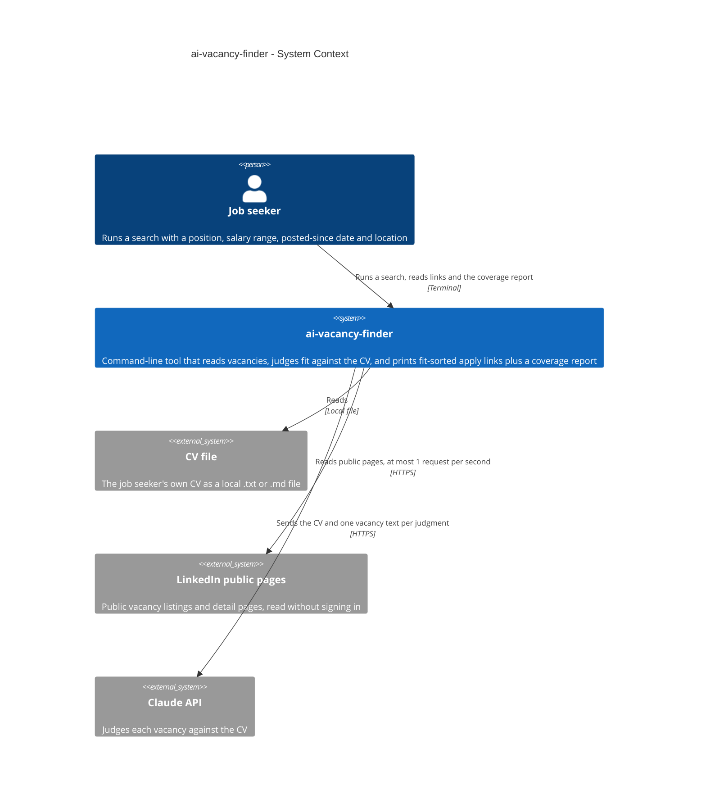

# Software Architecture Document — ai-vacancy-finder

## 1. Introduction and goals

**Intent.** A personal command-line tool for one job seeker. For a position, a salary range, a posted-since date and a location, it reads a source's public vacancy pages (LinkedIn first, no sign-in), judges each new vacancy against the job seeker's own CV with Claude, and prints apply links ordered by fit with a one-line reason. Every run ends with a coverage report that says what was read, dropped, judged and left unjudged, so a quiet or partial read never looks like "no jobs for you".

**Top-3 quality goals (1-liners; full scenarios in §10):**

1. **Auditable runs** — every run ends with a coverage report and never prints a bare empty list; a blocked, throttled, partial or empty read is loud (100% of runs end with a coverage report).
2. **Bounded cost and polite pace** — at most the judging limit (default 30) judgments per search, at most 1 page request per second toward each source, at most 5 min p95 per search.
3. **Seen-memory correctness** — each vacancy is shown once and a repost is recognised as already seen (0 vacancies listed twice across consecutive same-detail searches).

**Stakeholders.**

| Role | Interest | Sign-off owner? |
|---|---|---|
| Job seeker | Runs searches, reads the fit-sorted links and the coverage report, owns and approves this SAD | Yes |

## 2. Constraints

**Technical.**
- TypeScript on Node 22, ES modules; `engines` is `>=22` and the development machine runs 22.9.0 (repo ADR `docs/adr/0001-use-typescript-on-node-22.md`).
- `better-sqlite3` pinned to `^12.10.1`: the 13.0.3 prebuilt binary segfaults when opening a database on Node 22.9.0 (`CLAUDE.md` Gotchas). Re-test before moving to 13.
- Libraries the map plans but `package.json` does not list yet: `cheerio` (reading vacancy HTML), `zod` (the vacancy shape and validation of the AI's answer) and `@anthropic-ai/sdk` (used only in `src/matching/`). Everything else is built in: `fetch` for HTTP, `node:util` `parseArgs` for the command line.
- Architecture convention: three seams (vacancy source, fit judge, seen-store) wired once in `src/cli.ts` (`docs/adr/0002-organize-code-as-one-folder-per-vacancy-source.md`); only `src/store/` touches the SQLite file (`docs/adr/0003-keep-seen-memory-in-a-local-sqlite-file.md`).
- Tests run offline with vitest: sources against saved real pages in `test/fixtures/`, the fit judge against a fake; no test touches the network.

**Organisational.**
- One developer, who is also the only user. No effort budget or hard date is quoted; the only time signal is "useful within days" (spec §1), which is why v1 is one person, one CV, one source, run on demand.

**Conventions.**
- `CLAUDE.md` and `docs/architecture-map.md` (Conventions): a failing or empty source raises a typed error the coverage report shows and nothing is swallowed; a vacancy is the source name plus the site's own job number with a company-plus-title fingerprint beside it; migrations are numbered `.up.sql` / `.down.sql` pairs; the AI key comes only from `ANTHROPIC_API_KEY`; relative imports in `src/` and `test/` end in `.js`.

**Regulatory / external.**
- Reading LinkedIn's public pages is against its terms and may be blocked; the job seeker accepted this knowingly (`docs/idea-brief.md` §6).
- The CV (name, phone, email, employment history) is personal data and leaves the machine on every judgment, sent to the AI service; the seen memory never stores CV text (spec §6.1). A security review of exactly what leaves the machine is required once, before the first real run with a full CV.

**Product decisions settled at design (from spec §8).**
- Location: a search takes one place plus a remote-only switch.
- Pay in another currency or period: a stated pay is compared with the salary range only when its currency and its period (a year) match the range's; otherwise the vacancy is kept and tagged "pay not comparable". There is no currency conversion and no month-to-year or hour-to-year guessing.
- Judging limit: default 30, newest first (AC-21). The job seeker can override it for a single search.
- Open, carried to §11: what LinkedIn's public pages really show. The design assumes the worst case (rough ages only, pay often missing, no stated match count) and tolerates any real outcome.

## 3. Context and scope

The system is a command-line program that the job seeker runs on demand. It reads a source's public vacancy pages, reads the job seeker's own CV from a local file, sends the CV and one vacancy's text at a time to the Claude API to judge fit, and remembers what it has shown in a local file so later runs list only new vacancies. The trust boundary is the process itself: everything read from a source is untrusted data (it can hold instructions, a sign-in page or a cut-off description), and the only thing that crosses out is the CV and vacancy text going to the Claude API.

<!-- brownfield: skeleton only — src/cli.ts is a stub, plus the migration runner (src/store/migrate.ts) and the empty baseline migration 0001; no feature code exists yet -->

**External systems (in / out):**

| Actor or system | Type | Interaction |
|---|---|---|
| Job seeker | Person | Runs a search from the terminal with a position, salary range, posted-since date and location, then reads the fit-sorted apply links and the coverage report |
| CV file | Local file (input) | The job seeker's own CV as plain text (`.txt`) or Markdown (`.md`), read at the start of every run; its text goes to the Claude API with each judgment |
| LinkedIn public pages | System (external) | Public vacancy listings and detail pages read without signing in; untrusted content that may change, throttle or block |
| Claude API | System (external) | Receives the CV and one vacancy's text per judgment and returns a fit, a one-line reason and whether the vacancy text contained instructions; needs the key from `ANTHROPIC_API_KEY` |

The seen database (a local SQLite file) belongs to the system itself and appears in §5.

**C4 Context (L1):**

## 4. Solution strategy

<!-- pending -->

## 5. Building block view

<!-- pending -->

## 6. Runtime view

<!-- pending -->

## 7. Deployment view

<!-- pending -->

## 8. Crosscutting concepts

<!-- pending -->

## 9. Architecture decisions

<!-- pending -->

## 10. Quality requirements

<!-- pending -->

## 11. Risks and technical debt

<!-- pending -->

## 12. Glossary

<!-- pending -->
