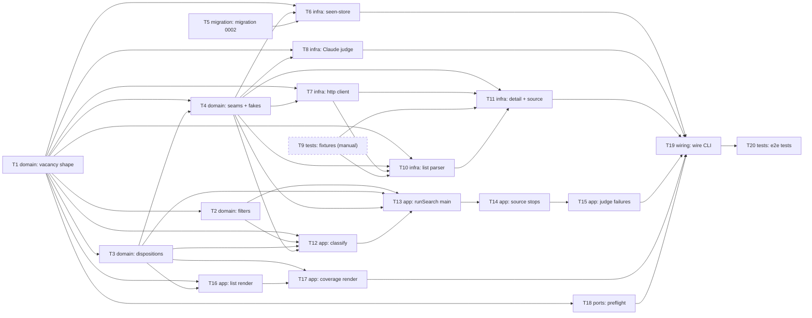

# Epic — ai-vacancy-finder

> **Spec:** [spec.md](../spec.md) · **Design:** [sad.md](../sad.md) · **Data model:** [data-model.md](../data-model.md) · **API:** [cli.md](../contracts/cli.md) (a `cli` surface, so the contract is the CLI contract, not OpenAPI) · **ADRs:** [adr/](../adr/)

## Goal

Ship the first version of the personal vacancy finder: one command that reads a source's public vacancy pages, judges each new vacancy against the job seeker's CV, prints apply links ordered by fit, and ends every run with a coverage report that says loudly when the source returned nothing or only part (spec §2). Each vacancy is shown once, and the cost of a run is bounded.

## Scope

- **In:** the pure domain rules and shared vacancy shape; the three seams (LinkedIn source with its polite HTTP client, Claude fit judge, SQLite seen-store) and the `shown_vacancy` migration; the `runSearch` pipeline; the report renderer; preflight and the wired CLI; the offline acceptance tests.
- **Out (spec §3):** applying on the job seeker's behalf or tracking applications; sources other than LinkedIn; scheduled runs and notifications; other job seekers, several CVs, or automating a signed-in account.

## Task map

Dashed node: T9 is done by hand by the job seeker; T10 and T11 cannot start until its fixtures exist.

### Waves (what can run in parallel)

| Wave | Tasks |
|---|---|
| 1 | T1, T5, T9 |
| 2 | T2, T3, T18 |
| 3 | T4, T16 |
| 4 | T6, T7, T8, T12, T17 |
| 5 | T10, T13 |
| 6 | T11, T14 |
| 7 | T15 |
| 8 | T19 |
| 9 | T20 |

`layer: migration` (T5) is serialized by `implement`. T13, T14 and T15 share `src/search/run-search.ts`, and T1 and T18 share `src/domain/search-input.ts`; both pairs are ordered by their dependencies anyway.

## Tasks

See [tracker.md](./tracker.md) for status. Machine contract: [tasks.json](../tasks.json).

| # | Task | Layer | Blocked by | DoD (short) |
|---|---|---|---|---|
| T1 | [Define the vacancy shape, the search input type, the clock and the repost fingerprint](./T01-vacancy-shape-clock-fingerprint.md) | domain | — | The fingerprint and vacancy-schema unit tests pass (case, spacing, separator collision, empty parts) and the three planned libraries are installed with the build green. |
| T2 | [Implement the date and salary filters and their tags as pure rules](./T02-filters-date-salary-tags.md) | domain | T1 | Unit tests for the date and salary verdicts pass for overlap, single figure, open bounds, currency/period mismatch, rough and missing dates, and the four tags. |
| T3 | [Define the disposition set, the run result and the accounting check](./T03-dispositions-and-run-result.md) | domain | T1 | Unit tests show every read vacancy is counted in exactly one bucket in the AC-10 order, the buckets add up to the read count, and a mismatch is detected. |
| T4 | [Define the three seam interfaces with their typed failures, the test fakes, and fix the fail-loudly wording](./T04-seam-interfaces-and-fakes.md) | domain | T1, T3 | The three seam interfaces and the test fakes compile and a fake-clock/fake-judge test passes; the CLAUDE.md fail-loudly sentence matches ADR 0002. |
| T5 | [Promote the staged shown_vacancy migration into the live migrations](./T05-migration-shown-vacancy.md) | migration | — | Migration 0002 applies and reverts cleanly (user_version 1→2→1), the table constraints reject empty values and duplicate keys, and the updated migrate tests pass. |
| T6 | [Implement the SQLite seen-store and the opener that creates or refuses the database](./T06-sqlite-seen-store.md) | infra | T1, T4, T5 | Seen-store tests pass against real SQLite: identity and fingerprint lookups, idempotent one-transaction marking, and an unusable or missing-folder database is reported instead of silently recreated. |
| T7 | [Build the shared polite HTTP client: pace, back-off and typed refusals](./T07-polite-http-client.md) | infra | T1, T4 | Fake-clock tests prove at most one request per second per client, at most 3 retries within 60 s of back-off, a throttled stop afterwards, and no fetch after a stop. |
| T8 | [Implement the Claude fit judge: rubric prompt, schema-checked answer, failure classes](./T08-claude-fit-judge.md) | infra | T1, T4 | Tests with a fake SDK client cover a valid answer, the instruction flag, an unusable answer and each service-error mapping, with one call per vacancy and no CV or key in any failure detail. |
| T9 | [Save real public LinkedIn pages as fixtures and record what they show](./T09-capture-linkedin-fixtures.md) | tests | — | Real public LinkedIn pages are saved in test/fixtures/linkedin/ with a README answering each sub-question of spec §8 open question 1, and the fixture inventory test passes. |
| T10 | [Parse LinkedIn results pages into cards and list them with typed stops](./T10-linkedin-list-parser.md) | infra | T1, T4, T7, T9 | Tests over the saved LinkedIn fixtures pass for card parsing, rough-age ranges, the expected count and the blocked, failed and empty stops, with no sign-in path. |
| T11 | [Parse LinkedIn detail pages, assemble the LinkedIn source and register it](./T11-linkedin-hydrate-and-source.md) | infra | T4, T7, T9, T10 | Tests over the saved detail fixtures pass for description, pay, the cut-off sign and the blocked and unreadable stops, and the LinkedIn source is registered behind the VacancySource seam. |
| T12 | [Classify cards: drop, skip seen and reposts, and order the candidates](./T12-classify-cards.md) | app | T1, T2, T3, T4 | Tests pass for the AC-10 check order, seen versus repost, same-search siblings, show-everything marks and both candidate orderings. |
| T13 | [Implement runSearch: list, classify, hydrate and judge under the limit, present, mark seen](./T13-run-search-main-flow.md) | app | T2, T3, T4, T12 | Offline runSearch tests pass for the happy path: at most the judging limit of judge calls, leftovers reported as limit and not marked seen, and vacancies marked seen only after the result is presented. |
| T14 | [Handle source stops and partial reads in runSearch](./T14-run-search-source-stops.md) | app | T13 | Tests through runSearch cover blocked, failed and empty at listing, throttled mid-hydration and the partial-read boundary; every stop kind reaches the result and fails the run, and a partial read does not. |
| T15 | [Handle judge failures, unexpected errors, an unusable memory and a failed print in runSearch](./T15-run-search-judge-failures-and-unexpected.md) | app | T14 | Tests through runSearch cover an unusable answer, each service-level judge failure, an unexpected exception, an unusable store, a failing presenter and the accounting check, with no CV or key in any failure message. |
| T16 | [Render the fit-sorted vacancy list with its tags and marks](./T16-render-vacancy-list.md) | app | T1, T3 | Tests pass for two-group fit ordering with stable ties, all tags and marks shown, the partial-description and instruction suffixes, and a low-fit vacancy still listed. |
| T17 | [Render the coverage report, the loud warnings and the whole result document](./T17-render-coverage-report-and-document.md) | app | T3, T16 | Golden tests reproduce the CLI contract's example outputs; every failure mode ends with a coverage report whose buckets add up to Read and a RUN FAILED line, and a partial read warns without failing. |
| T18 | [Implement preflight: argument parsing, input validation, CV, key and the contact notice](./T18-preflight-args-input-cv-key.md) | ports | T1 | Tests cover every usage-error code, several problems reported together, the CV format and emptiness rules, the missing key, and a contact notice that never prints the matched text. |
| T19 | [Wire the adapters in src/cli.ts and set the output streams and exit status](./T19-wire-cli.md) | wiring | T6, T8, T11, T15, T17, T18 | main() tests pass for exit statuses 0, 1 and 2 and stdout/stderr separation, the smoke tests still pass against dist/cli.js, and the concrete adapters are wired only in src/cli.ts. |
| T20 | [Add the cross-cutting offline acceptance tests for the quality scenarios](./T20-acceptance-tests-offline.md) | tests | T19 | Offline end-to-end tests pass for every failure mode ending in a summing coverage report, zero repeat listings across runs, judge calls within the limit, and no CV or key text in any output. |

## Risks / Hard rules

- **A manual gate sits in front of the parsers.** T9 needs real saved pages (spec §8 open question 1, sad §11). If `implement` reaches T10 or T11 with no fixtures it must stop and ask, never invent HTML.
- **Fail loudly** (`CLAUDE.md`): a source that fails or returns nothing is a typed stop shown in the coverage report; no empty list without its coverage line. Every task that touches the pipeline or the report inlines this rule.
- **Offline tests** (`CLAUDE.md`): sources against saved real pages, the judge against a fake, no test touches the network (T20 adds a guard).
- **Secrets and the CV** (spec §6.1, sad QG-5): the AI key comes only from `ANTHROPIC_API_KEY`; neither the key nor CV text may appear in any output or in the database. T15, T18, T19 and T20 carry this.
- **Contract items still marked `# unresolved`** in [cli.md](../contracts/cli.md) (see [api-sync-report.md](../contracts/api-sync-report.md) §E): OQ-1 (a salary range needs `--currency`), OQ-2 (`judge.service_rejected`), OQ-3 (the 'could not be judged' line). The tasks implement the contract as written; if the spec or SAD changes, the affected task files are stale (T8, T15, T17, T18).
- **Not tasks, but gates before use:** the one-time security review of exactly what leaves the machine (spec §6.1) before the first real run with a full CV, and the fit spot-check of 20 pairs in the first two weeks (spec §6, §7). Both belong to `ship` and real use. Separately, `CV_Serhii_Lyzun.docx` is committed locally and the tool cannot read `.docx` (sad §11) — keep it out of the repository and out of any push.
- **Task count.** 20 tasks for an L feature (spec size L, route standard); no task is estimated above half a day of work, and ~9.25 person-days in total.
