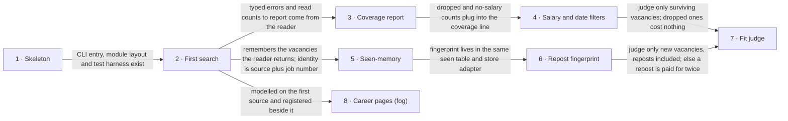

# Roadmap — ai-vacancy-finder

> **A decomposition, not a promise.** The overall idea broken into incremental steps: what each
> step is, where it comes from, how big it is — or that nobody has looked at it yet — and in which
> order, and parallel lanes, we walk them. **No dates** (except shipped history), **no scores** —
> order is the prioritization. The *solution* for any step lives in its `docs/features/<slug>/`
> spec, not here.

## Destination

The owner runs one command with a position, salary range, posted-since date and location, and gets fit-sorted apply links to new vacancies from LinkedIn and the target companies' career pages, each with a one-line reason and an honest coverage report of what was actually read.

## Steps

| # | Step | Source | Size | Status |
|---|---|---|:---:|---|
| 1 | Project skeleton: the CLI boots, tests, lint and migrations run | `docs/architecture-map.md` §Module inventory | S | shipped |
| 2 | First search: position, salary range, posted-since date, location and CV go in; LinkedIn's public listings are read into the shared vacancy shape and printed; a blocked, throttled or empty source raises a typed error | `docs/idea-brief.md` §1 Raw idea · §6 Risks · §8 Open questions | L | idea |
| 3 | Coverage report that never stays silent: every run ends with how many were read, failed or blocked, and a loud warning when a source returned nothing | `docs/idea-brief.md` §6 Risks · §7 Recommendation | S | idea |
| 4 | Salary and posted-since filters: a stated salary outside the range is dropped, no stated salary is kept, tagged "salary not listed" and shown below confirmed ones | `docs/idea-brief.md` §1 Raw idea · §6 Risks | S | idea |
| 5 | Seen-memory: later runs list only new vacancies, with a "show everything" option | `docs/idea-brief.md` §7 Recommendation · §6 Risks | M | idea |
| 6 | Repost fingerprint: a job reposted with a new date is recognised as already seen | `docs/idea-brief.md` §6 Risks | S | idea |
| 7 | Fit judge and fit-sorted list: Claude judges each surviving new vacancy against the CV, and the apply links come out sorted by fit with a one-line reason | `docs/idea-brief.md` §2 Problem · §7 Recommendation | M | idea |
| 8 | Company career pages as a second source → see [Not yet specified](#not-yet-specified) | `docs/idea-brief.md` §7 Recommendation · §8 Open questions | fog | idea |

## Not yet specified

| Area | What we'd have to learn | Blocks | How it gets sharpened |
|---|---|:---:|---|
| Company career pages as a second source | Which companies go on the target-company list, how their pages differ from one another (each is built differently), and whether a vacancy from a career page needs a different identity rule than source plus job number | 8 | A conversation with the owner for the company list, then a recon pass on one or two real career pages once the first search works |

## Out of scope

- Serving other job seekers or handling several CVs — a personal tool; a product for others needs a different data source and carries much larger legal exposure (`docs/idea-brief.md` §5).
- Tracking applications (applied / rejected / saved) — a different, larger product; worth considering only after the search part proves useful (`docs/idea-brief.md` §5).
- Automating the owner's logged-in LinkedIn account — risks a ban on the account the owner needs for the search (`docs/idea-brief.md` §5).
- Applying on the owner's behalf — the output is links to open and apply by hand (`docs/idea-brief.md` §5).

## Open decisions

| # | Question | Type | Owner | Blocks |
|---|---|:---:|:---:|:---:|
| D1 | What form does the CV take (text or Markdown only, or PDF too), and does a separate "what I want next" note sit beside it? | grilling | human | 2, 7 |
| D2 | How many vacancies per run may be judged, given each judgment costs money and time? | grilling | human | 7 |
| D3 | Where do results appear (terminal or a file), and is the tool run on demand only or on a schedule? | grilling | human | 7 |
| D4 | On real saved pages, does each listing carry a plain posted date, how large is a results page (10 or 25), how does pay appear, and which signals mean blocked? Second-hand scraper docs disagree or were untested. | prototype | agent | 2, 4 |
| D5 | If a listing shows only a relative age such as "1 week ago", how coarse a "posted since" day is acceptable? Only matters if D4 finds no plain date. | grilling | human | 4 |

## Decisions so far

- Location or remote is a search input from the first version → [`docs/idea-brief.md`](idea-brief.md) §8 (closes its first open question; recorded in step 2)
- TypeScript on Node 22, ES modules → [`docs/adr/0001-use-typescript-on-node-22.md`](adr/0001-use-typescript-on-node-22.md)
- One folder per vacancy source behind a shared vacancy shape; three seams only → [`docs/adr/0002-organize-code-as-one-folder-per-vacancy-source.md`](adr/0002-organize-code-as-one-folder-per-vacancy-source.md)
- Seen-memory in a local SQLite file; identity is source plus job number, plus a repost fingerprint → [`docs/adr/0003-keep-seen-memory-in-a-local-sqlite-file.md`](adr/0003-keep-seen-memory-in-a-local-sqlite-file.md)
- Vacancies without a salary are kept and tagged; a stated salary outside the range is dropped → [`docs/idea-brief.md`](idea-brief.md) §6
- Reading LinkedIn's public pages is done knowingly despite its terms → [`docs/idea-brief.md`](idea-brief.md) §6

## Dependency graph

## Execution path

The waves are cut with `docs/architecture-map.md` as the zone reference. In waves 3 and 4 the two lanes each add one wiring line to `src/cli.ts` (the composition root); the hunks are disjoint and a merge conflict there is unlikely but possible. Step 8 is fog and enters no wave until its recon pass gives it a size.

| Wave | Steps | Zone per step (why parallel-safe) | Unlocks |
|:---:|---|---|---|
| 1 | 1 (shipped) | skeleton: `src/cli.ts`, `test/` | 2 |
| 2 | 2 | `src/cli.ts` · `src/domain/` · `src/sources/linkedin/` (new) · `src/sources/index.ts` (new) · `test/fixtures/` | 3, 5 |
| 3 | 3 ∥ 5 | 3: `src/report/` · 5: `src/store/` + `migrations/` (0002 pair, new) (disjoint) | 4, 6 |
| 4 | 4 ∥ 6 | 4: `src/domain/` + `src/report/` · 6: `src/store/` + `migrations/` (0003 pair, new) (disjoint) | 7 |
| 5 | 7 | `src/matching/` · `src/report/` | — |

## Shipped

| Step | Shipped | Link |
|---|---|---|
| 1 · Project skeleton | 2026-09-19 | commit `c6500f7` — [`docs/features/_scaffold/`](features/_scaffold/tasks.json) |
